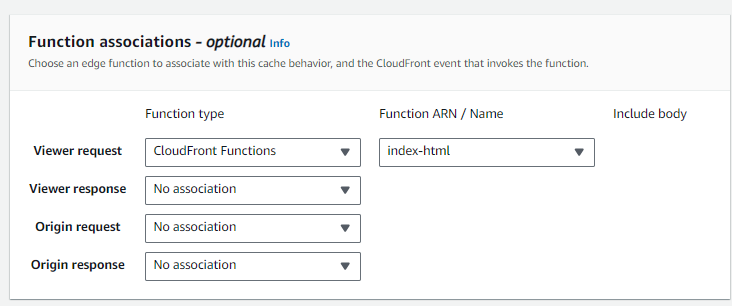

# Enabling HTTPS for S3 static websites

[Amazon S3 has an option to serve bucket content as a static website](https://docs.aws.amazon.com/AmazonS3/latest/userguide/WebsiteHosting.html). You enable the "Static website hosting" option in the S3 bucket properties, tell it the name of a root index HTML document to serve (e.g. `index.html`) and it will give you an endpoint that looks like this: `http://BUCKET-NAME.s3-website.eu-west-2.amazonaws.com` . Assuming that you have allowed public read access to the bucket, visiting `http://BUCKET-NAME.s3-website.eu-west-2.amazonaws.com/directory/subdirectory` will serve the `index.html` file inside the `/directory/subdirectory` folder inside the bucket, which will in turn load other files from the bucket such as Javscript, images etc. as appropriate.

This is certainly convenient if you have some simple content you want to serve and you don't want to spin up a whole new web server to do it. However, it has some drawbacks:

- The endpoint domain `BUCKET-NAME.s3-website.eu-west-2.amazonaws.com` is a mess, and if you're serving customer-facing content you do not want your URLs to look like a mess.
- S3 static website hosting can only serve content over an HTTP connection. Probably not a real security risk since the simple content being served shouldn't be doing anything stupid like trying to collect people's payment details, but still not a good look in a world where everyone moved to HTTPS a long time ago and web browsers expect it as the default and flag HTTP connections as insecure.

Fortunately, AWS has a couple of other services we can use to solve both problems at once.

**CloudFront**

[Amazon CloudFront](https://docs.aws.amazon.com/AmazonCloudFront/latest/DeveloperGuide/Introduction.html) is a CDN that sits in front of and routes traffic to designated "origin" services. One of these origin services is S3. We can use CloudFront together with a custom domain that we own to serve S3 bucket content to visitors to our custom domain.

**Certificate Manager**

We can also use [Amazon Certificate Manager](https://docs.aws.amazon.com/acm/latest/userguide/acm-overview.html) to generate free SSL certificates for our custom domain. Certificates are good for a year and auto-renew as long as the DNS entry used to verify ownership of the domain persists. These certificates can be attached to the CloudFront distribution handling traffic for our custom domain, allowing us to enable HTTPS connections for this traffic.

**Route 53**

Not strictly necessary, any DNS management service should do as long as you have the permissions to edit DNS entries for your desired custom domain. However, it's a little easier with Route 53 as Amazon Certificate Manager can automatically add the required DNS entries for your certificate.

## Setup

### Amazon Certificate Manager

We start with Amazon Certificate Manager. Open it up in the Amazon web console.

**Important**: Make sure that your region is set to `us-east-1` (N. Virginia) before requesting a cert. Only certs issued in this region are compatible with CloudFront. You will have to ask Amazon as to why.

Once your region is correctly set up:

- Go to "Request Certificate" in the left panel.
- It will ask what certificate type you want to request. We want to stick with the default option of a public certificate. Click "Next".


- It will then ask you for:
    - A fully qualified domain name. Put in your custom domain here, e.g. `subdomain.example.com`.
    - The validation method. Stick with DNS validation.
    - The key algorithm to use. The default of RSA 2048 is fine.
- Click "Request" at the bottom of this page to request the certificate.

Then go to "List Certificates" in the left panel and select your new certificate to view the details. The certificate status should show as "Pending", because you haven't yet added the DNS CNAME entry used to validate the certificate for your custom domain. If you use Route 53 as your DNS, there is a "Create records in Route 53" button here that will automatically add this entry. Otherwise, the required CNAME name and value are also listed in this page and can be added to your DNS entries manually.

Once the DNS validation entry has been added, the certificate status should switch from "Pending" to "Success" within a couple of minutes. 

### CloudFront

**Important**: It turns out the secret to serving an S3 static website via CloudFront is for it _not_ to be configured as a static website. Make sure that the "Static website hosting" option on your target S3 bucket is _disabled_ before you do this. You can also block public access to the bucket, since we'll be adding an IAM policy to it later that grants access to our CloudFront distribution. All access should go via the CloudFront endpoint secured with HTTPS.

Open CloudFront in the Amazon web console, and then "Create distribution" in the top right corner.

This will open up a complicated set of options. Fortunately we only need to care about a subset of them. Anything not mentioned here should be left blank/as default.


- The *Origin domain* needs to point at the target S3 bucket. Clicking in the search box will open a dropdown of available AWS services to connect to, and the S3 bucket should be listed here. Selecting it will automatically populate the "Origin domain" field with the correct value.
- Under *Origin access*, select "Origin access control settings (recommended)".
- This will cause a further dropdown to appear allowing selection of the Origin Access Control to use. Click "Create new OAC", which will bring up a splash with the OAC details already filled in. Change the name or description if you want, then click "Create". Then select the new OAC from the dropdown.


- Underneath *Viewer*, the "Viewer protocol policy" should be either "Redirect HTTP to HTTPS" or "HTTPS only". We're not going to the trouble of setting up HTTPS here just to allow HTTP connections anyway.
- Underneath *Cache key and origin requests*, we need to set a cache policy that tells CloudFront how long to cache content at its edge nodes for before checking the origin for updated content.
  - If you have selected an S3 bucket as your origin, this will be pre-filled with the `CachingOptimized` policy which has a default TTL of 1 day (i.e. content will be cached for a day). This may be suitable for your requirements, however if you update the content in the S3 bucket it will take up to a day for the change to be reflected in CloudFront's cache, which is what you're actually going to be serving to end users. If you just want to use CloudFront as a secure frontend for the S3 bucket and you're not bothered about its caching functions at all, select the `CachingDisabled` policy instead. This will set the default TTL to 0 seconds - in other words, content will be fetched directly from the origin S3 bucket on every request.
- Underneath *Web Application Firewall*, pick the appropriate setting depending on how paranoid you are. Since this is a static website I'm of the strong opinion that you probably don't need to pay extra for a WAF.
- Under *Alternate domain name (CNAME)*, enter the custom domain you want to use, e.g. `subdomain.example.com`.
- Under *Custom SSL certficate*, open the dropdown. The certficate you requested earlier via Certificate Manager should be listed here. Select it.

Once finished, click "Create distribution" at the bottom of the page.

The distribution will take a while to create. When it's created, select it from the list of distributions to bring up the origin details and click the *Origins* tab. Select the S3 bucket origin and then "Edit" to bring up the origin details. Underneath *Origin access* there should now be a blue box telling you to give CloudFront permission to access the S3 bucket by adding a policy to the S3 bucket permissions.


Click the "Copy policy" button inside this blue box, and then "Go to S3 bucket permissions". Open the *Permissions* tab, and paste the policy info into the *Bucket policy* section here, editing as appropriate to make it co-exist nicely with any existing policies that you want to keep.

Go back to CloudFront, and select your distribution again to view the details. Underneath *Distribution domain name* there should be a domain name that starts with a UID and looks like `abcde12345.cloudfront.net`. This is the CloudFront endpoint that it serves your bucket content under - so, if you have an `index.html` file and associated website content at `s3://bucket-name/directory/subdirectory/index.html`, then entering `https://abcde12345.cloudfront.net/directory/subdirectory/index.html` into your browser should load the website.

### Route 53 (or other DNS)

The final step is to add a DNS record for the custom domain aliasing it so that it points to the CloudFront distribution domain name. Route 53 has fancy dropdowns for this if you select the "Alias" toggle that let you connect to the CloudFront distribution, but if you're not using Route 53 you can just create a CNAME record with your custom domain `subdomain.example.com` as the record name and the CloudFront distribution domain name `abcde12345.cloudfront.net` as the record value.

After the A record has been created, entering `https://subdomain.example.com/directory/subdirectory/index.html` into your browser should load the `index.html` at `s3://bucket-name/directory/subdirectory/index.html`, as above.

You can test HTTP connections to make sure they're non-functional or redirect to HTTPS as appropriate. If you don't want to expose your entire bucket to the world you can also tweak the IAM policy you added to the S3 bucket to restrict CloudFront's access to specific directories inside the bucket. Finally, you can configure the CloudFront distribution's error pages if you want a slightly nicer experience for the end user than the basic 403/404 pages provided out of the box.

### Avoiding having to request `index.html` directly with a CloudFront function

One of the features we've lost by not configuring our S3 bucket as a static website host is the ability to set a default object to request when hitting the endpoint URL. If the S3 bucket were a static website, we could set `index.html` as the default object, and then `https://subdomain.example.com/directory/subdirectory/` would automatically load `s3://bucket-name/directory/subdirectory/index.html`, with no need to append `index.html` to the end of the request URL. This is worth the tradeoff of not having to make the entire bucket publicly accessible (which is a prerequisite of S3 static websites), but we can also bodge this behaviour back in using a Cloudfront Function.

In the AWS web console, in the left panel, select *Functions*. Create a new function. Give it a name (such as `index-html`) and description, and click "Create function". Then add some function code that looks like this [Stack Overflow answer](https://stackoverflow.com/a/76581267), appropriately modified for your purposes:

```javascript
function handler(event) {
      var request = event.request;
      var uri = request.uri;
      
      // Check whether the URI is missing a file name.
      if (uri.endsWith('/')) {
          request.uri += 'index.html';
      } 
      // Check whether the URI is missing a file extension.
      else if (!uri.includes('.')) {
          request.uri += '/index.html';
      }

      return request;
    }
```

Click "Save Changes", switch to the *Publish* tab, and publish the function.



Then select your CloudFront distribution and go to the *Behaviors* tab. You should have one default behaviour for all requests (\*). Select it and open the Edit interface. Scroll to the bottom, where you should see a section called *Function associations*. Here you should set the "Viewer request" function type to "CloudFront Functions", and select the `index-html` function you just published. Then save the changes.

This function will now run on every request, and will rewrite incoming requests that do not already include a file name to add `index.html` on the end before passing them on to the origin S3 bucket.

The drawback of this method is that you're now running this CloudFront Function on *every* request to your website, which is additional cost - however it's [comparatively cheap](https://aws.amazon.com/cloudfront/pricing/) at $0.10 per 1 million invocations, compared to $1.00 per 1 million HTTPS requests.
